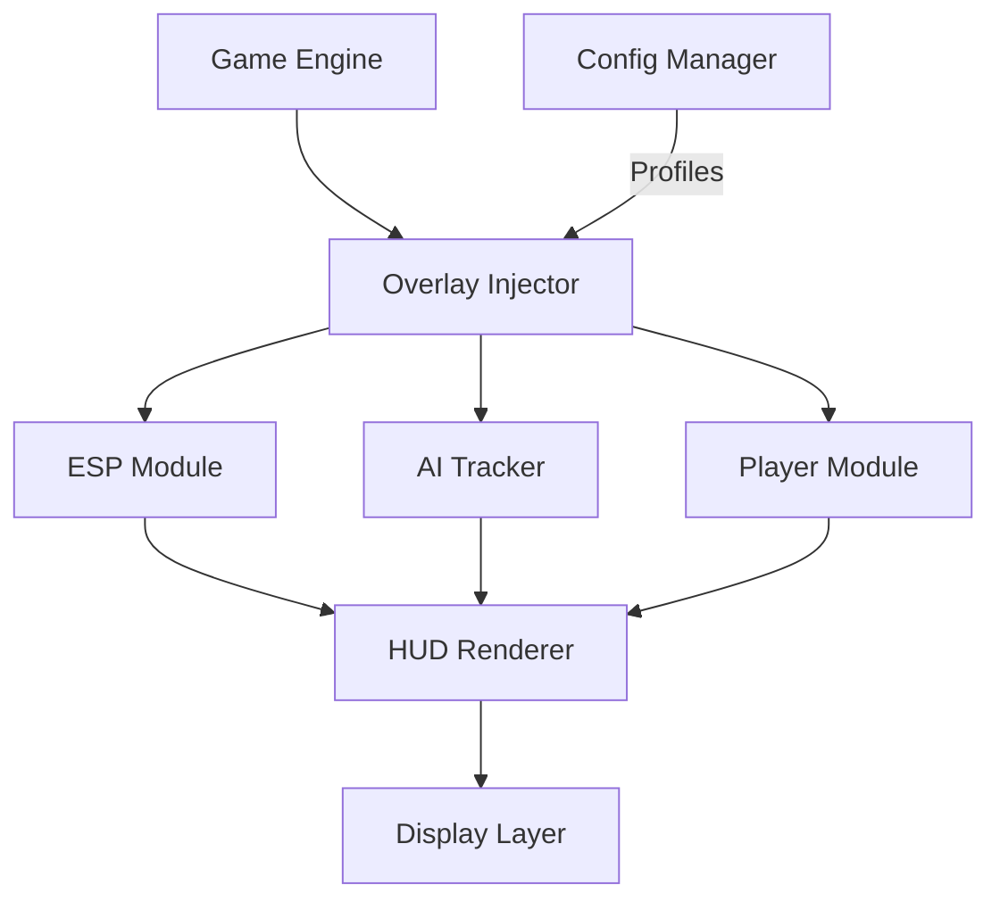

# DEVOUR Trainer 👁‍🗨

Face the cult’s terror with strategy and control. The **DEVOUR Trainer** gives you the ultimate edge in horror survival — offering enhanced **awareness overlays**, **resource recovery toggles**, and **AI analysis** that helps you survive longer and react faster.

Built for precision and stability, this software merges modern overlay technology with real-time game metrics, giving you a tactical advantage in one of the most unpredictable co-op horror experiences ever made.

---

## 🧭 Overview

Unlike generic trainers, **DEVOUR Trainer** focuses on *information and control* rather than brute force. It uses an intelligent overlay engine that tracks movement, AI zones, and stamina drain — all without altering save data or in-game mechanics.

You stay immersed, but never blind.

---

## 🔥 Core Features

* **👁 ESP Overlay:** Highlights cultists, goats, ritual items, and AI patrols through walls.
* **💨 Infinite Stamina:** Run endlessly without exhaustion penalties.
* **🧠 AI Path Tracker:** Displays current enemy routes and danger zones in real time.
* **📡 Entity Radar:** 3D minimap for teammates, key items, and enemy direction.
* **⚙️ Config Profiles:** Create and save setups for *Solo*, *Duo*, or *Full Squad* runs.
* **🎯 Safe Zone Alerts:** Color-coded warning zones that predict AI proximity before jumpscares.
* **💾 Portable Profiles:** Export `.devcfg` setups and share with teammates.

[!IMPORTANT]
All overlays render externally — no game files or memory values are modified, ensuring safety and full patch compatibility.

---

## 🖥 Compatibility

| Platform      | Support | Notes                  |
| ------------- | ------- | ---------------------- |
| Windows 10    | ✅       | Full DX11 optimization |
| Windows 11    | ✅       | Tested on DX12 builds  |
| Steam Edition | ✅       | Auto-attach supported  |
| Epic Edition  | ✅       | Manual attach required |
| VR/Cloud      | ❌       | Not supported          |

> 💡 *Accessibility Tip:* Toggle **High Contrast HUD** in settings for better visibility in dark maps like “The Inn” or “The Town.”

---

## ⚙️ Setup Guide

1. **Extract** the archive into a folder like `C:\DEVOURTrainer`.
2. **Launch the game** and wait until the main menu appears.
3. **Run the trainer** as admin:

   ```bash
   DEVOURTrainer.exe --inject --safe
   ```
4. **Press F10** to toggle the overlay.
5. Choose your active modules: ESP, Stamina, Radar, etc.

**Example Advanced Launch:**

```bash
DEVOURTrainer.exe --profile=SquadRadar --dx=12 --frametime-sync
```

[!NOTE]
If the overlay doesn’t appear immediately, toggle between *Fullscreen Windowed* and *Borderless Mode* once.

---

## 🧩 Config Examples

**1. Survival Awareness (Balanced)**

```ini
[esp]
entity_outline=on
ai_path=on
key_item_highlight=on
outline_color=#FF5050
ally_color=#50C0FF
goat_color=#FFCC00
```

**2. Speedrunner Mode**

```ini
[player]
stamina=infinite
move_speed=1.3
pickup_delay=off
ai_alerts=on
map_radar=on
```

**3. Co-op Safety Profile**

```ini
[team]
teammate_markers=on
distance_tags=meters
audio_pings=on
safe_zone_radius=12
```

---

## 🧭 System Diagram



Each module works asynchronously, keeping frame times stable even when multiple tracking systems are active.

---

## 🧠 Advanced Options

| Flag               | Description                                     |
| ------------------ | ----------------------------------------------- |
| `--safe`           | Runs overlay in secure non-invasive mode        |
| `--frametime-sync` | Matches overlay refresh rate with render frames |
| `--eco`            | Limits overlay to 60 FPS for older GPUs         |
| `--dx=11/12`       | Forces specific DirectX path                    |
| `--profile=NAME`   | Loads `.devcfg` configuration                   |
| `--log=on`         | Enables debug performance logging               |

[!WARNING]
Avoid enabling both **AI Path Tracker** and **Map Radar 3D** at once on low-end systems — they are GPU-intensive in dark lighting.

---

## ❓ FAQ

**Q1: Is DEVOUR Trainer safe to use in multiplayer?**
A: Yes — but visibility effects are client-side only. Other players cannot see ESP elements.

**Q2: Can I modify jump scare timing?**
A: No. The trainer reads AI triggers but doesn’t alter horror event logic.

**Q3: Why does the overlay stutter sometimes?**
A: Enable `--frametime-sync` for smoother refresh alignment.

**Q4: Are settings saved automatically?**
A: Yes. Each exit automatically saves your last used configuration in `/profiles/`.

**Q5: Does it affect game difficulty?**
A: No gameplay modifiers — it purely improves awareness and performance efficiency.

---

## 🧩 Recommended Presets

* **Solo Scout:** ESP + Radar + AI Path Tracker (for exploration).
* **Squad Support:** Teammate markers, key item tracking, stamina off.
* **Speed Demon:** Infinite stamina, map radar, reduced pickup delay.

Switch via:

```bash
DEVOURTrainer.exe --profile=SoloScout
```

---

## 👁 Final Thoughts

The **DEVOUR Trainer** brings control and awareness into a game that thrives on chaos. Whether you’re mastering map routes, coordinating with teammates, or analyzing AI patterns, this trainer ensures that fear never equals helplessness.

Stay aware. Stay fast. Survive the cult.
